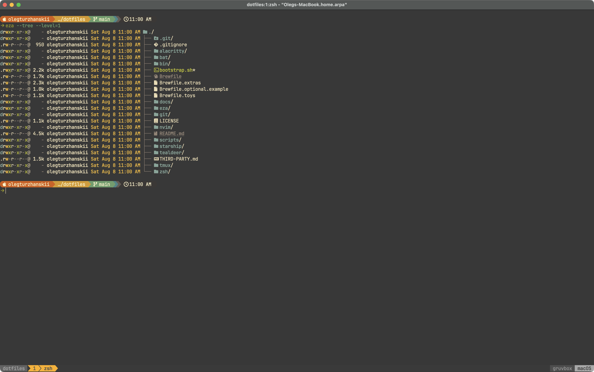
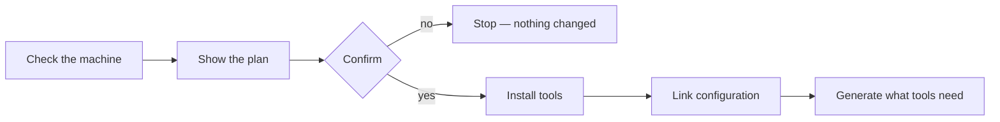
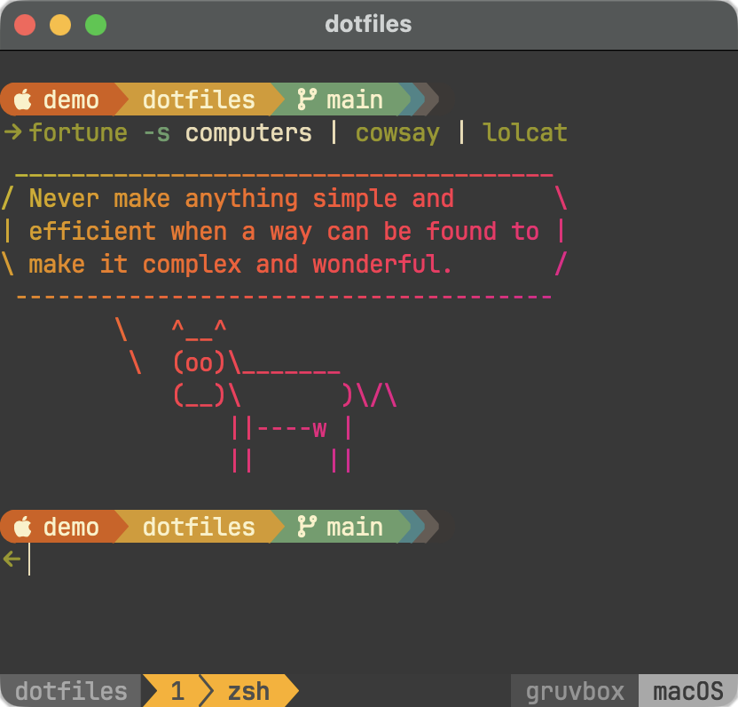

# dotfiles

My command-line environment: the configuration for my terminal, shell, editor,
and the tools I use with them.

It also holds enough to rebuild that environment on a new Mac without my
having to remember how I assembled it the first time.

This is one person's setup, not a framework.

Take whatever is useful, and expect to disagree with some of it.

If you build on this, a link back to the repository would be appreciated.

## What it looks like



## Before you start

You need an Apple Silicon Mac, the Xcode Command Line Tools
(`xcode-select --install`), and [Homebrew](https://brew.sh).

Setup checks for all three and stops if any is missing rather than installing
them for you.

## Setting it up

```sh
git clone https://github.com/olegturzhanskii/dotfiles.git ~/dotfiles
cd ~/dotfiles
./bootstrap.sh --dry-run
```

The dry run prints exactly what would happen and changes nothing.

When the plan looks right, run `./bootstrap.sh`.



Each step is a separate file in `scripts/` that you can also run on its own.

**Install tools** — everything missing from `Brewfile`, via Homebrew.

**Link configuration** — every file here gets a symbolic link where its tool
expects it, so `alacritty/.config/alacritty/alacritty.toml` becomes
`~/.config/alacritty/alacritty.toml`.

Editing either one changes both.

**Generate what tools need** — the terminal description for Alacritty, tmux
plugins, and the `tldr` page cache.

## What setup will not do

It never overwrites or deletes a file you already have; if something is in the
way, it reports the conflict and stops before changing anything.

It never upgrades software that is already installed, never touches Git, and
never installs the optional Brewfiles.

## Undoing it

Every file it creates is a symbolic link:

```sh
stow --delete --dir=~/dotfiles --target=~ \
  alacritty tmux nvim bat eza git htop mc starship task tealdeer zsh
```

Tools that Homebrew installed stay installed.

## Checking it

```sh
./bin/doctor
```

Read-only.

It reports whether your machine matches this repository and names the fix for
anything that does not.

## The Brewfiles

`Brewfile` is authoritative and lists only tools this repository configures, so
that `brew bundle check` means something.

`Brewfile.extras` is general-purpose tools I use but do not configure here, and
`Brewfile.toys` is fun things, because a terminal is allowed to be enjoyable.

`Brewfile.optional` is private and never committed, and
`Brewfile.optional.example` is the tracked template that explains the pattern.

Only the first is installed by setup:

```sh
brew bundle install --file=Brewfile.toys
```



## Public, private, and generated

This split is the most useful idea to take from here.

**Public** is everything you can see: configuration anyone may read and copy.

**Private** is configuration that works but says something about me — where I
live, who I work with — and lives in `Brewfile.optional` and
`~/.config/git/config.local`, both ignored and neither present here.

**Generated** is what a machine builds for itself: caches, plugin clones,
completion dumps.

Setup links individual files rather than whole directories so that generated
state has nowhere to land in this repository.

**Secrets** appear nowhere in this design.

## Things you have to do yourself

**Set your Git identity.**

```sh
cp ~/.config/git/config.local.example ~/.config/git/config.local
```

Your commit email becomes public the first time you push, so choose it
deliberately.

**Enable Touch ID for `sudo` inside tmux, if you want it.**

`pam-reattach` is installed for you, but loading it means adding a line to
`/etc/pam.d/sudo_local` above the Touch ID line, which needs your password.

## Keeping it up to date

Nothing here updates itself, with one exception: `tealdeer` refreshes its own
page cache daily.

```sh
./bin/outdated
```

That reports what is available and applies nothing.

The commands that actually update things are in [docs/maintenance.md](docs/maintenance.md).

## Questions this answers

If you came here for one specific thing rather than for a setup.

| Question | Where |
|---|---|
| Why does `TERM=alacritty` not resolve on macOS? | [gotchas.md](docs/gotchas.md), and [`scripts/40-derived-state.sh`](scripts/40-derived-state.sh) |
| How does copying in the terminal reach the macOS clipboard, even inside tmux or over SSH? | [`tmux.conf`](tmux/.config/tmux/tmux.conf) turns on `set-clipboard` and the `clipboard` terminal feature, which is OSC 52 |
| Why does the Option key not work as Alt? | [`alacritty.toml`](alacritty/.config/alacritty/alacritty.toml); without `option_as_alt` nothing in the terminal ever receives Meta |
| How do I stop tools writing into my dotfiles repository? | `stow --no-folding`, in [`scripts/30-configuration.sh`](scripts/30-configuration.sh) and [design.md](docs/design.md#where-state-lives) |
| How do I get zsh completions for a tool that ships none? | [`plugins.zsh`](zsh/.config/zsh/plugins.zsh), where generated completions are installed as zinit plugins |
| How do I keep completions in step with `uv tool install`? | [`plugins.zsh`](zsh/.config/zsh/plugins.zsh), driven by the receipt files `uv` writes for itself |
| How do I edit a file on another machine without mounting it? | [`mc/.config/mc/ini`](mc/.config/mc/ini); mc opens `sftp://` in a panel, and F3 and F4 still run the local `bat` and `nvim` |
| Is this process running under Rosetta, or natively? | [`htop/.config/htop/htoprc`](htop/.config/htop/htoprc), which adds htop's `TRANSLATED` column |
| How do I get a structural diff without giving up delta? | [`git/.config/git/config`](git/.config/git/config); delta stays the pager and difftastic is the difftool |
| How do I keep private configuration out of a public repository? | [`Brewfile.optional.example`](Brewfile.optional.example), and the checks in [`bin/doctor`](bin/doctor) |
| Does a `Brewfile` have to list everything I have installed? | [design.md](docs/design.md#what-belongs-in-the-brewfile) |
| How reproducible is this without Nix, and where does reproducibility stop? | [design.md](docs/design.md#what-the-project-promises) |

## Reading further

[docs/design.md](docs/design.md) — how the project is put together and what it
promises.

[docs/theming.md](docs/theming.md) — changing the colors.

[docs/maintenance.md](docs/maintenance.md) — updating.

[docs/gotchas.md](docs/gotchas.md) — six things that fail confusingly, and why.

[THIRD-PARTY.md](THIRD-PARTY.md) — what here is not mine.

## License

MIT, in [LICENSE](LICENSE).

Take whatever is useful.
