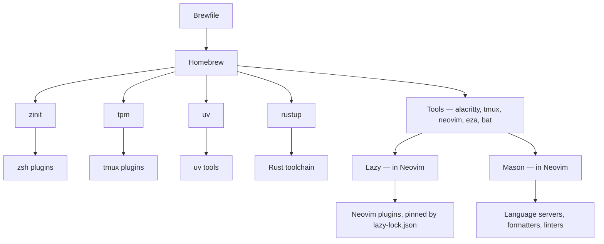

# How this project is put together

## Vocabulary

These words mean one thing throughout this repository.

| Term | Meaning |
|---|---|
| **Tool** | A program installed by Homebrew, such as `eza` or `tmux` |
| **Configuration** | A file in this repository that tells a tool how to behave |
| **Package** | One top-level directory here, holding the configuration for one tool |
| **Plugin** | An add-on installed by a tool's own manager, not by Homebrew |
| **Bootstrap** | The one-time setup that installs tools and links configuration |
| **Generated state** | Anything a machine builds for itself: caches, plugin clones, lockfile-driven installs |
| **Vendored file** | A copy of someone else's file, kept here because only that file is used |
| **Private configuration** | Real configuration that stays on the machine and out of this repository |

## Where things live

If you are wondering where a particular kind of setting belongs, start here.

| Looking for | Look in | Because |
|---|---|---|
| Environment variables, XDG paths | `zsh/.zshenv` | Read by every zsh, interactive or not |
| `PATH` and anything Homebrew sets up | `zsh/.config/zsh/.zprofile` | Read once per login, before interactive setup |
| Aliases, options, interactive behavior | `zsh/.config/zsh/.zshrc` | Read only by interactive shells |
| zsh plugins and generated completions | `zsh/.config/zsh/plugins.zsh` | Sourced from `.zshrc`; everything zinit does is here |
| Terminal window, font, colors | `alacritty/.config/alacritty/` | |
| Keybindings, status line, tmux plugins | `tmux/.config/tmux/tmux.conf` | |
| Editor, LSP, formatters, Neovim plugins | `nvim/.config/nvim/init.lua` | Mostly one file, as kickstart intends |
| Diff and merge presentation | `git/.config/git/config` | |
| Which tools get installed | `Brewfile` | |
| Colors, everywhere | six files | See [theming.md](theming.md) |

The zsh split is the part people usually ask about, and the rule is when each
file is read, not what goes in it.

`git-delta` deserves the same clarification: Git stays the source of truth for
history, and delta only changes how a diff is drawn on screen.

Removing the `[core] pager` line gives you plain Git output and changes nothing
else.

For anything beyond that, each tool's own documentation is better than a
summary here would be.

## What the project promises

Given an Apple Silicon Mac with the Xcode Command Line Tools, Homebrew, and a
network connection, bootstrap installs every tool this repository declares,
links every configuration file, and generates what the configuration needs.

Run `./bin/doctor` at any time to check the result.

**Guaranteed:** every tool in `Brewfile` installed, every configuration file linked
or the setup halts on the conflict, `TERM=alacritty` resolving, no existing
file ever overwritten, and repeat runs changing nothing.

**Not guaranteed:** exact versions.

Homebrew has no per-repository lockfile, and neither zinit nor tpm can pin a
plugin to a commit.

Neovim is the exception: `lazy-lock.json` pins every plugin exactly.

Saying so is better than implying a precision that does not exist.

## Who owns what

Six managers install things on this machine, and each owns a distinct layer.

Homebrew installs the tools, including the other managers.

Each manager then owns its own layer and nothing else.

The one place the layers meet is tooling that exists in both Homebrew and
Mason.

Mason puts its own directory first on the path inside Neovim, so Neovim runs
Mason's copy and the shell runs Homebrew's.

The rule is **Homebrew owns shell tooling, Mason owns Neovim tooling**, and the
two copies may be different versions.

## Where state lives

Every piece of state is exactly one of these, and that decides where it lives.

| Kind | Example | Where |
|---|---|---|
| Configuration | `plugins.zsh`, `tmux.conf` | Tracked here |
| Declared tools | `Brewfile` | Tracked here |
| Installed tools | `eza`, `zinit`, `tpm` | The Homebrew prefix |
| Generated state | terminfo entries, plugin clones, completion caches | XDG directories, never here |
| Private configuration | `Brewfile.optional`, `git/config.local` | On the machine, ignored |
| Secrets | passwords, keys, tokens | Nowhere in this design |

This table is why bootstrap links individual files rather than whole
directories.

If `~/.config/zsh` were a link to a directory in this repository, everything zsh
wrote there would appear in the working tree, and keeping it out would depend
on remembering to ignore each new file.

Linking file by file means generated state has nowhere to land here.

The cost is that adding a configuration file needs
`./scripts/30-configuration.sh` run again.

## How other people's work is represented

In order of preference:

1. **A Homebrew package**, if Homebrew ships it — including `tpm` and `zinit`, which
   are more often cloned by hand.
2. **A plugin manager**, if the tool has one.
3. **A vendored file**, if one specific file is used from a much larger project.
4. **A file written here**, if it has been modified — modifying something makes it
   yours to maintain.

**This project does not use Git submodules.**

A submodule says "this directory is that repository"; using one theme file out
of thousands does not fit that description, and a comment in the file itself
is more visible to a reader than a submodule pointer.

Attribution is handled by a header in each vendored file and by
`THIRD-PARTY.md`.

## What belongs in the Brewfile

One test: *if removing the tool would break or degrade something this
repository configures, it belongs in `Brewfile`.*

That keeps `brew bundle check` a real test of whether the environment is intact.

Everything else goes in `Brewfile.extras` or `Brewfile.toys`, and anything that
should not be published goes in `Brewfile.optional`, which is not part of this
repository.
